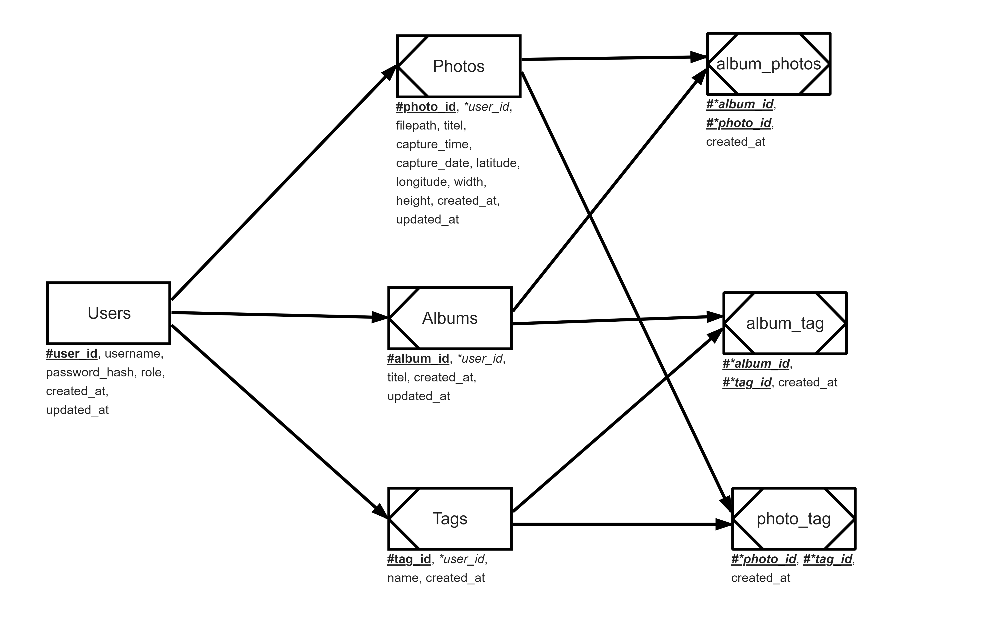

# Informatik Projekt SoSe2024 - Fotoverwaltung Webanwendung
Gruppe 8 - Angel Tise, Mathis Reichenbächer

## Technische Anforderungen
- Frontend: HTML, CSS, Bootstrap, Typescript, Fetch-API
- Backend: Java, Eclipse Vert.x, RESTful-API, JDBC
- Datenhaltung: MariaDB

## Planung
- [Sitemap](docs/Sitemap.pdf)
- [Wireframes](docs/Wireframes.pdf)

## Database
**SERM**  
{height=400px}